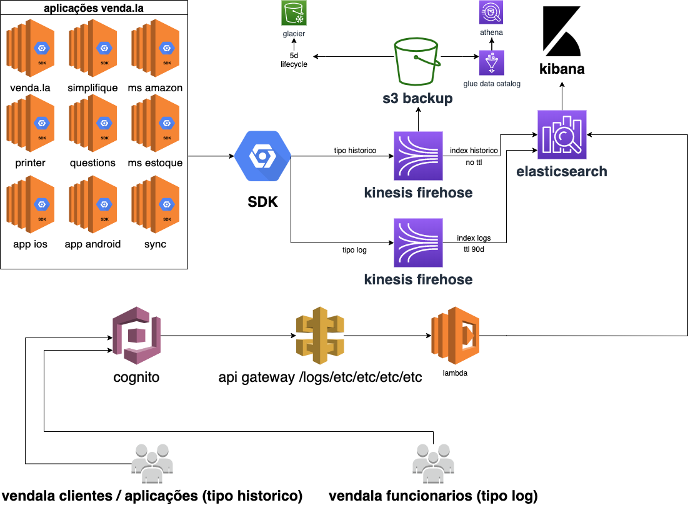

# Venda.la LOGS

#### SDK para o micro serviço de logs.

Este pacote visa padronizar o envio para o micro serviço de logs.


`Documentação`
## 

Explicando:
```
Nossos sistemas precisam guardar logs diariamente.
Como não temos um lugar centralizado, este projeto visa centralizar e guardar tudo.

Nossas aplicações vão utilizar este SDK para enviar ao elasticsearch com o kinesis de intermediário.

Lifecycle resumido:
1 - sistema venda.la tem necessidade de log
2 - sistema venda.la chama sdk
3 - sistema venda.la envia log a partir do sdk
4 - sdk se comunica com o kinesis da aws enviando o payload e dados da aplicação
5 - kinesis abre a stream e envia ao elasticsearch em lotes
6 - fim do ciclo de vida

Posteriormente o usuário poderá consultar isso via kibana ou direto na api do elasticsearch.

```